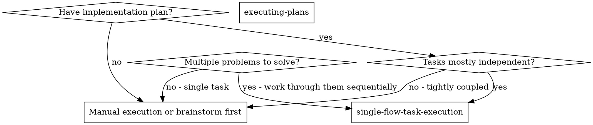
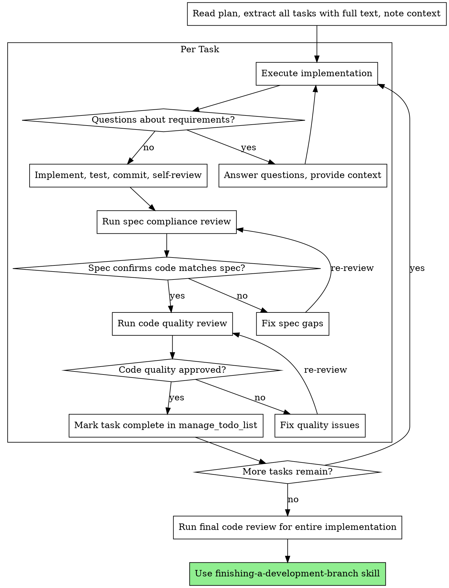

# Single-Flow Task Execution

Execute plans by working through one task at a time with two-stage review after each: spec compliance review first, then code quality review.

**Core principle:** One task at a time + two-stage review (spec then quality) = high quality, disciplined iteration.

## Execution Model

All work happens in a single execution thread. No parallel dispatch.

**Rules:**

1. **One active task only** — never work on multiple tasks simultaneously.
2. **One execution thread only** — no parallel dispatch.
3. **No parallel subagents** — do not use `runSubagent` or dispatch independent agents.
4. **Track progress** by updating `manage_todo_list` at each state change.
5. **Mark todos clearly** — in-progress before starting, completed immediately after finishing.

## When to Use



**Use when:**

- You have an implementation plan with multiple independent tasks
- 2+ test files failing with different root causes (work through them one at a time)
- Multiple subsystems broken independently
- Each problem can be understood without context from others
- Structured execution with quality gates is needed

**Don't use when:**

- Failures are related (fix one might fix others) — investigate together first
- Tasks are tightly coupled and need full system understanding
- Single simple task that doesn't need review structure

**vs. Executing Plans (worktree/session-based):**

- Same session (no context switch)
- Fresh `manage_todo_list` update per task (clean scope)
- Two-stage review after each task: spec compliance first, then code quality
- Faster iteration (no human-in-loop between tasks)

## The Process



## Task Decomposition

When facing multiple problems (e.g., 5 test failures across 3 files):

### 1. Identify Independent Domains

Group failures by what's broken:

- File A tests: User authentication flow
- File B tests: Data validation logic
- File C tests: API response handling

Each domain is independent — fixing authentication doesn't affect validation tests.

### 2. Create Task Units

Each task gets:

- **Specific scope:** One test file or subsystem
- **Clear goal:** Make these tests pass / implement this feature
- **Constraints:** Don't change unrelated code
- **Expected output:** Summary of what changed and verification results

### 3. Execute Sequentially with Review

Work through each task one at a time using the full review cycle.

### 4. Review and Integrate

After all tasks:

- Run full test suite to verify no regressions
- Check for conflicts between task changes
- Run final code review on entire implementation

## Task Brief Structure

For each task, prepare:

**Scope:**

- **Bad:** "Fix the validation bug" — unclear where
- **Good:** Paste error messages, test names, relevant code paths

**Constraints:**

- **Bad:** No constraints — task might refactor everything
- **Good:** "Only modify src/auth/ directory"

**Output:**

- **Bad:** "Fix it" — no visibility into what changed
- **Good:** "Report: root cause, changes made, test results"

**Reviews:**

- **Bad:** "It works, move on" — quality debt
- **Good:** Implement then spec review then quality review then next task

## Example Workflow

```
You: I'm using single-flow-task-execution to execute this plan.

[Read plan file: docs/plans/feature-plan.md]
[Extract all 5 tasks with full text and context]
[manage_todo_list: add all tasks as not-started]

--- Task 1: Hook installation script ---

[manage_todo_list: mark Task 1 in-progress]
[Prepare task brief with full text + context]
[Execute implementation]

Questions: "Should the hook be installed at user or system level?"
Answer: "User level (~/.config/superpowers/hooks/)"

Implementation:
  - Implemented install-hook command
  - Added tests, 5/5 passing
  - Self-review: Found I missed --force flag, added it
  - Committed

[Run spec compliance review]
Spec review: Spec compliant — all requirements met, nothing extra

[Run code quality review]
Code review: Strengths: Good test coverage, clean. Issues: None. Approved.

[manage_todo_list: mark Task 1 completed]

--- Task 2: Recovery modes ---

[manage_todo_list: mark Task 2 in-progress]
[Prepare task brief with full text + context]
[Execute implementation]

Implementation:
  - Added verify/repair modes
  - 8/8 tests passing
  - Self-review: All good
  - Committed

[Run spec compliance review]
Spec review: Issues found:
  - Missing: Progress reporting (spec says "report every 100 items")
  - Extra: Added --json flag (not requested)

[Fix issues: remove --json flag, add progress reporting]
[Run spec compliance review again]
Spec review: Spec compliant now

[Run code quality review]
Code review: Issue (Important): Magic number (100) should be a constant

[Fix: extract PROGRESS_INTERVAL constant]
[Run code quality review again]
Code review: Approved

[manage_todo_list: mark Task 2 completed]

... [Continue through remaining tasks] ...

[After all tasks complete]
[Run final code review on entire implementation]
Final review: All requirements met, ready to merge

[Use finishing-a-development-branch skill]
Done!
```

## Red Flags

**Never:**

- Start implementation on main/master branch without explicit user consent
- Skip reviews (spec compliance OR code quality)
- Proceed with unfixed review issues
- Work on multiple tasks simultaneously
- Skip scene-setting context (task needs to understand where it fits)
- Accept "close enough" on spec compliance (reviewer found issues = not done)
